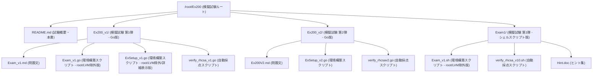

# RHCSA (EX200) RHEL 10 試験概要・対策チェックリスト

本ドキュメントは、**Red Hat Enterprise Linux 10 (RHEL 10)** をベースとした **Red Hat Certified System Administrator (RHCSA) 試験 (EX200)** の試験概要、主要な変更点、および詳細な出題範囲をまとめたものです。

---

## 1. 試験の基本情報

RHCSA（EX200）は、実際のRHEL環境を操作して提示された要件を満たすシステムを構築・修正する、**完全実技形式（パフォーマンスベース）**の試験です。

| 項目 | 詳細 |
| :--- | :--- |
| **試験時間** | 3時間 |
| **問題形式** | 実機エミュレータを使用した実技試験（選択肢や記述問題はなし） |
| **合格基準** | 300点満点中 **210点以上**（約70%の得点率） |
| **有効期限** | 合格日から3年間 |
| **前提条件** | 特になし（誰でも受験可能） |

---

## 2. RHEL 10（v10）における主な変更点

RHEL 10環境の試験では、現代のインフラ管理の手法に合わせて出題範囲が一部刷新されています。RHEL 9向けの教材で勉強する場合は、以下の差分に注意してください。

### 🟢 新たに追加・強化されたトピック
* **systemd タイマー（systemd Timers）の作成と管理**
  * 従来の `cron` や `at` に代わり、`systemd` を用いた定期タスクのスケジュール管理が明示的に要求されます。
  * `.timer` およびそれに対応する `.service` ユニットファイルの作成・連携、`OnCalendar` 構文の習熟が必要です。
* **Flatpak パッケージの管理**
  * デスクトップ環境やアプリケーション管理の標準化に伴い、Flatpakリポジトリの構成、パッケージのインストール・削除、システム/ユーザーレベルの管理が出題範囲に加わっています。
* **高度なブート構成（GRUB2）**
  * `/etc/default/grub` の編集、カーネルパラメータの変更、および設定の再生成（再起動後の有効化）の確実性が求められます。

### 🔴 削除・除外されたトピック
* **コンテナ管理（Podman）の除外**
  * RHEL 9試験で大きなウェイトを占めていた「Podmanによるルートレスコンテナの実行、systemdとの統合、永続ストレージ構成」は、RHEL 10のRHCSA範囲からは**除外**されました（上位試験に集約）。
* **ACL（アクセス制御リスト）の除外**
  * `setfacl` や `getfacl` を用いた高度な権限設定要件が削除され、標準の `ugo/rwx` パーミッションおよび **SGID** を用いたディレクトリ共有設定に集約されました。

---

## 3. 分野別・詳細出題範囲（試験目的）

### ① 基本ツールの理解と使用
* [ ] シェルプロンプトへのアクセスと、正しい構文（オプション、引数）でのコマンド実行
* [ ] 入出力リダイレクト（`>`、`>>`、`|`、`2>` など）の駆使
* [ ] `grep` と正規表現を用いたテキスト・ログファイルの検索と分析
* [ ] SSH（公開鍵認証を含む）を使用したリモートシステムへのアクセスと設定
* [ ] マルチユーザーターゲット（`multi-user.target`）へのログインとユーザー切り替え
* [ ] `tar`、`gzip`、`bzip2` によるファイルのアーカイブ・圧縮・解凍
* [ ] `vim` などのテキストエディタを用いた設定ファイルの正確な編集
* [ ] ファイル・ディレクトリの作成、削除、コピー、移動
* [ ] ハードリンクおよびソフト（シンボリック）リンクの作成と使い分け
* [ ] 標準パーミッション（rwx）と所有者（ユーザー/グループ）の表示・変更
* [ ] `man` ページや `/usr/share/doc` を用いたシステム内ドキュメントの検索

### ② 稼働中システムの運用とトラブルシューティング
* [ ] システムの正常な起動、再起動、シャットダウン
* [ ] ブートプロセスへの割り込みによる**ルートパスワードの初期化（紛失時のレスキュー手順）**
* [ ] 異なるターゲット（`rescue.target` など）への手動ブート
* [ ] CPU/メモリ負荷の高いプロセスの特定、強制終了（`kill`）、優先度（nice値）の調整
* [ ] `tuned` を用いたシステムチューニングプロファイルの適用と確認
* [ ] `journalctl` によるログの確認と、システムジャーナル（`journald`）の永続化構成
* [ ] systemd サービスの起動、停止、ステータス確認、および自動起動（enable/disable）の切り替え

### ③ ソフトウェア・パッケージの管理
* [ ] 独自のDNFリポジトリ構成（`/etc/yum.repos.d/` への `.repo` ファイル作成）
* [ ] `dnf` コマンドを使用したパッケージの検索、インストール、アップデート、削除
* [ ] Flatpak リポジトリの追加・削除、および Flatpak アプリケーションの管理

### ④ シンプルなシェルスクリプトの作成
* [ ] 条件分岐（`if` 文や `test` / `[ ]` 構文）の記述
* [ ] ループ構文（`for` ループなど）を用いた、ファイルや引数に対するバッチ処理の自動化
* [ ] スクリプトの入力引数（`$1`、`$2`、`$#` など）の適切な処理
* [ ] スクリプト内でのコマンド置換（出力結果の変数への格納）

### ⑤ ローカルストレージとファイルシステムの構成
* [ ] GPT ディスク上でのパーティションの作成、削除、タイプ変更（`gdisk` 等）
* [ ] 物理ボリューム（PV）、ボリュームグループ（VG）、論理ボリューム（LV）の作成・削除・拡張
* [ ] `ext4`、`xfs`、`vfat` ファイルシステムの作成（フォーマット）
* [ ] UUID またはファイルシステムラベルを用いた永続マウント設定（`/etc/fstab`）
* [ ] 既存の論理ボリュームおよびファイルシステムの非破壊的な拡張（`lvextend`）
* [ ] スワップ（Swap）スペースの追加、有効化、および永続マウント
* [ ] グループコラボレーション用ディレクトリの作成と **SGID（Set Group ID）** の設定
* [ ] NFS を利用したネットワーク共有ストレージの手動および永続マウント
* [ ] `autofs`（オンデマンドマウント）の導入とマップファイルの構成

### ⑥ 基本ネットワークの管理
* [ ] 静的（Static）または動的（DHCP）な IPv4 / IPv6 アドレスの構成（`nmcli` の習熟）
* [ ] デフォルトゲートウェイ、DNS サーバー、検索ドメインの設定
* [ ] ホスト名（Hostname）の永続的な設定（`hostnamectl`）
* [ ] `/etc/hosts` ファイルによるローカルな名前解決の追加

### ⑦ セキュリティとサービス制限の管理
* [ ] `firewalld` を用いたファイアウォールルールの構成（サービス、ポート、リッチルールの追加と永続化）
* [ ] SELinux の動作モード（Enforcing / Permissive / Disabled）の確認と永続的変更
* [ ] ファイル・ディレクトリに対する正しい SELinux コンテキストの適用（`restorecon`、`semanage fcontext`）
* [ ] SELinux Boolean（ブーリアン値）の切り替えによる、サービス制限の緩和
* [ ] SELinux におけるネットワークポートラベルの構成（デフォルト以外のポートでのサービスバインド許可）

---

## 4. 合格のための極意（最重要チェックポイント）

1. **すべての設定は「再起動（Reboot）に耐える」こと**
   * 試験の採点は、すべての作業が終了した後に**システムを強制再起動して自動スクリプトで検証**されます。
   * どれだけ完璧にコマンドを実行しても、`/etc/fstab` の記述漏れ、`nmcli` の保存忘れ、`firewalld` の `--permanent` 忘れ、`systemctl enable` の落とし穴などにより、再起動後に設定が消えていれば**一律0点**となります。作業後は必ずセルフ再起動を行い、設定が残っているか確認してください。
2. **ネットワーク設定の失敗は全滅を意味する**
   * 試験環境は複数の仮想マシンで構成され、相互に通信を行って採点される場合があります。マシンのIPアドレスやルーティング、ホスト名の初期設定を誤ると、その後のすべての問題（NFSマウント、スクリプト実行など）がドミノ倒しで不正解になるリスクがあります。序盤のネットワーク構成は最も慎重に行ってください。
3. **ローカルの `man` ページを「カンニングペーパー」にする**
   * 試験中に外部のインターネット検索はできませんが、システムにインストールされている `man` ページや `/usr/share/doc/` 内のサンプルは自由に使えます。
   * 特に、`systemd.timer` や `autofs`（`auto.master`）、`firewalld` のリッチルールなど、構文を暗記しにくいものは、`man` ページからサンプルを引っ張ってくるテクニックを確実に身につけておきましょう。

---

## 5. 模擬試験用 Go プログラムのビルドと実行方法

本リポジトリに同梱されている [ExSetup_v2.go](file:///root/Ex200/Ex200_v2/ExSetup_v2.go) (環境構築プログラム) および [verify_rhcsav2.go](file:///root/Ex200/Ex200_v2/verify_rhcsav2.go) (採点プログラム) は、Go 言語 (Golang) で記述されています。
これらをテスト環境 (RHEL 10) で実行する、または実行可能バイナリとしてビルドする方法は以下の通りです。

### 5-1. 直接実行する (コンパイルと実行を同時に行う)

Go コンパイル環境がインストールされているサーバー上で、プログラムを事前にビルドせずに直接実行することができます。環境構築時や検証作業の際に最も手軽な方法です。

* **環境構築の実行 (root権限が必要):**
  ```bash
  go run ExSetup_v2.go
  ```

* **採点の実行:**
  ```bash
  go run verify_rhcsav2.go
  ```

### 5-2. ビルドして実行ファイルを作成する

Go プログラムをコンパイルし、単一の実行可能バイナリファイルを生成します。ビルドしたバイナリは、Go環境がインストールされていない環境でも単独で実行可能です。

1. **プログラムのビルド:**
   ```bash
   go build ExSetup_v2.go
   go build verify_rhcsav2.go
   ```
   * このコマンドを実行すると、同じディレクトリに `ExSetup_v2` および `verify_rhcsav2` という名前の実行可能ファイルが生成されます。

2. **バイナリの実行:**
   ```bash
   # 環境構築の実行 (root権限が必要)
   ./ExSetup_v2
   
   # 採点の実行
   ./verify_rhcsav2
   ```

### 5-3. 静的リンクバイナリをビルドする (他のLinux環境への持ち運び用)

C言語ライブラリに依存しない**完全な静的バイナリ (Static Binary)** としてビルドする方法です。Goコンパイラが入っていない他の RHEL 10 サーバーにコピーしてそのまま動かしたい場合に最適です。

```bash
CGO_ENABLED=0 GOOS=linux go build -o ExSetup_v2_static ExSetup_v2.go
CGO_ENABLED=0 GOOS=linux go build -o verify_rhcsav2_static verify_rhcsav2.go
```
* `-o <ファイル名>` オプションで出力されるバイナリ名を指定しています。
* 生成された `ExSetup_v2_static` と `verify_rhcsav2_static` は他の RHEL 10 サーバーへ転送して、即座に実行できます。

---

## 6. ディレクトリ構成とファイルの参照方法

本リポジトリ (`/root/Ex200`) の配下には、模擬試験の問題・環境構築スクリプト・自動採点スクリプトが、バージョンや用途ごとに整理されて配置されています。各ファイルの内容と参照方法は以下の通りです。


 
 ### 6-1. 模擬試験 第1弾 (Ex200_v1)
 Go言語ベースで構築された模擬試験第1弾です。
 * **問題文の参照**:
   * [Exam_v1.md](file:///root/Ex200/Ex200_v1/Exam_v1.md)
 * **環境構築プログラムの実行 (※すべてのスクリプトからrootおよびLVMの構築ロジックは除外されています)**:
   * **詳細な進捗表示付きで環境構築を行う場合**:
     ```bash
     go run /root/Ex200/Ex200_v1/ExSetup_v1.go
     ```
   * **標準形式で環境構築を行う場合**:
     ```bash
     go run /root/Ex200/Ex200_v1/Exam_v1.go
     ```
 * **自動採点プログラムの実行**:
   ```bash
   go run /root/Ex200/Ex200_v1/verify_rhcsa_v1.go
   ```
 
 ### 6-2. 模擬試験 第2弾 (Ex200_v2)
 Go言語ベースで構築された、RHEL 10向けの追加/修正問題を含む模擬試験第2弾です。
 * **問題文の参照**:
   * [Ex200V2.md](file:///root/Ex200/Ex200_v2/Ex200V2.md)
 * **環境構築プログラムの実行**:
   ```bash
   go run /root/Ex200/Ex200_v2/ExSetup_v2.go
   ```
 * **自動採点プログラムの実行**:
   ```bash
   go run /root/Ex200/Ex200_v2/verify_rhcsav2.go
   ```
 
 ### 6-3. レガシー・シェルスクリプト版 (Exam1)
 Bashシェルスクリプトで記述された、模擬試験第1弾の初期バージョンです。
 * **環境構築スクリプトの実行 (※LVMおよびrootの構築ロジックは除外されています)**:
   ```bash
   bash /root/Ex200/Exam1/Exam_v1.sh
   ```
 * **自動採点スクリプトの実行**:
   ```bash
   bash /root/Ex200/Exam1/verify_rhcsa_v10.sh
   ```
 * **ヒント・解説ドキュメントの参照**:
 * **ヒント・解説ドキュメントの参照**:
  * [Hint.doc](file:///root/Ex200/Exam1/Hint.doc)

---

## 7. 実行ログ機能について（使用者目線での説明）

本模擬試験のすべての Go 言語プログラム（環境構築および自動採点スクリプト）には、実行記録を自動的に記録する**実行ログ機能**が搭載されています。これにより、学習者がいつ、どのスクリプトを実行し、どのような結果になったのかを後から一覧で確認することができます。

### ログの出力先
実行ログは以下の優先順位でファイルに自動追記されます：
1. `/var/log/ex200_execution.log`（root 権限で実行した場合の標準ログファイル）
2. `/tmp/ex200_execution.log`（権限エラー等で上記に書き込めない場合のフォールバック先）

### 記録される情報
ログの各行には、以下のフォーマットで実行履歴が記録されます：
```text
[タイムスタンプ] [プログラム名] User: 実行ユーザー | Status: 実行状態 | Details: 詳細情報
```

* **タイムスタンプ**: `YYYY-MM-DD HH:MM:SS` 形式
* **プログラム名**: `ExSetup_v1`, `Exam_v1`, `verify_rhcsa_v1`, `ExSetup_v2`, `verify_rhcsav2`
* **実行ユーザー**: スクリプトを実行した Linux ユーザー名（例: `root`）
* **実行状態**:
  * `STARTED`: プログラムが起動したタイミング
  * `SUCCESS`: 環境構築が正常に完了したタイミング
  * `FINISHED`: 自動採点が終了したタイミング
  * `FAILED`: root 権限不足などで実行が途中で失敗したタイミング
* **詳細情報**: 構築の成否、あるいは採点結果のスコア（例: `Score: 90/140, Status: PASS`）

### ログの確認方法
Linux ターミナルから以下のコマンドを実行することで、実行履歴をいつでも確認できます：

```bash
# 履歴を一覧で表示する
cat /var/log/ex200_execution.log

# リアルタイムで実行ログの追記を監視する
tail -f /var/log/ex200_execution.log
```


